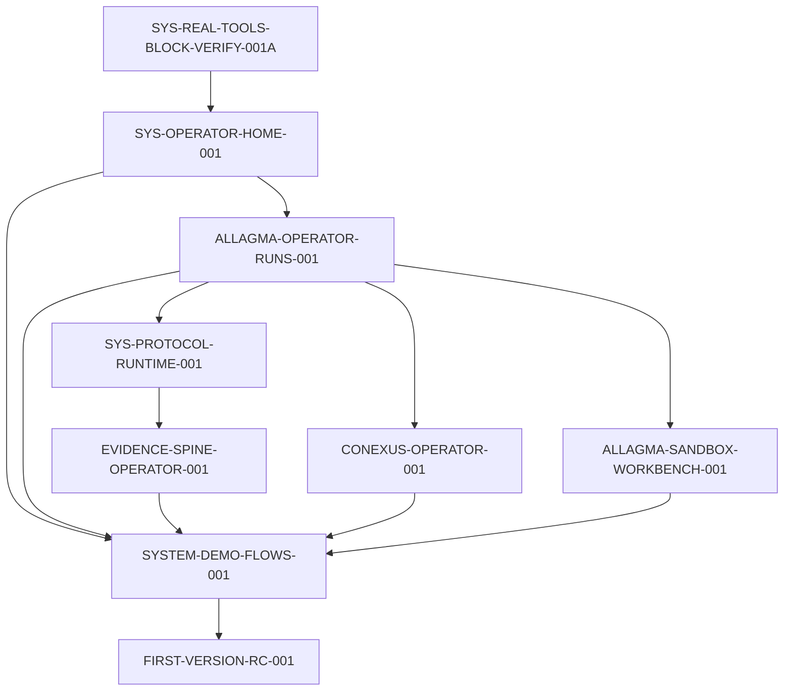

# Dependency Map

```mermaid
flowchart TD
  A[SYS-REAL-TOOLS-BLOCK-VERIFY-001A] --> B[SYS-OPERATOR-HOME-001]
  B --> C[ALLAGMA-OPERATOR-RUNS-001]
  C --> D[SYS-PROTOCOL-RUNTIME-001]
  D --> E[EVIDENCE-SPINE-OPERATOR-001]
  C --> F[CONEXUS-OPERATOR-001]
  C --> G[ALLAGMA-SANDBOX-WORKBENCH-001]
  B --> H[SYSTEM-DEMO-FLOWS-001]
  C --> H
  E --> H
  F --> H
  G --> H
  H --> I[FIRST-VERSION-RC-001]
```

Protocol-runtime work improves Evidence Spine, but should not block the basic operator home/run/demo if it becomes too broad.
