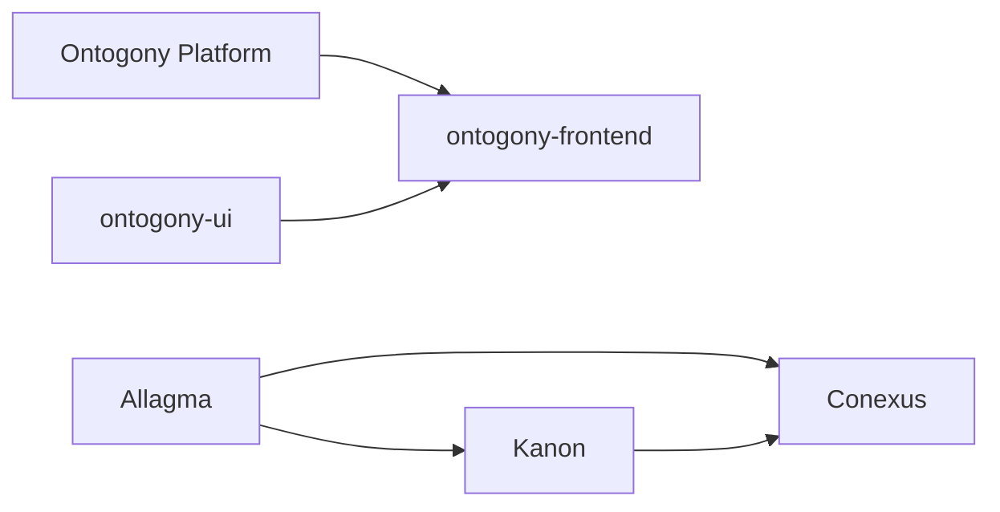
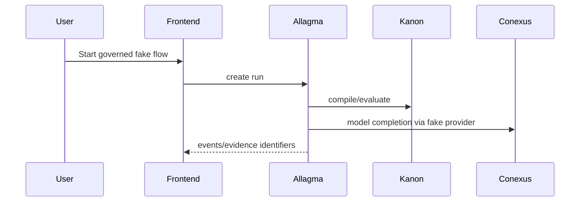
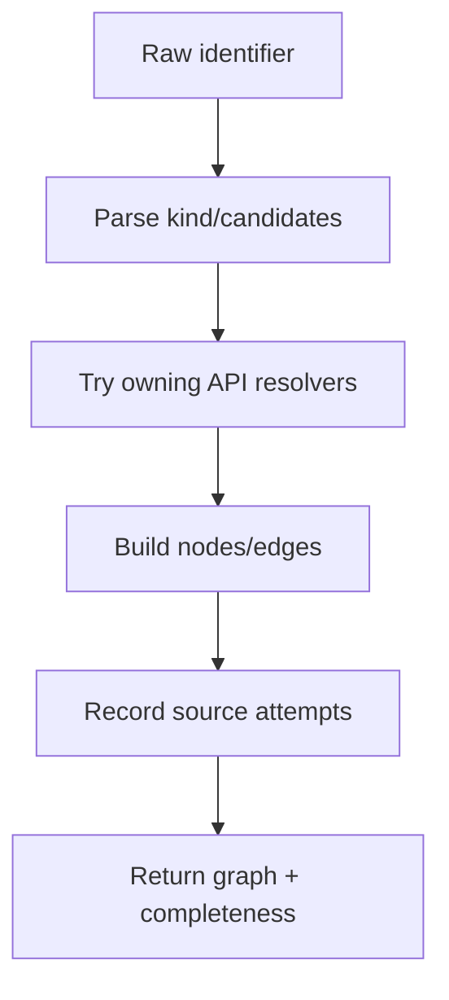
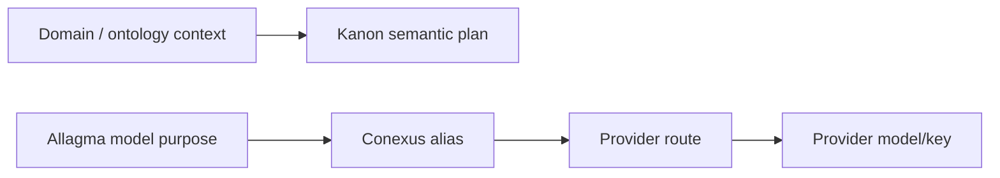
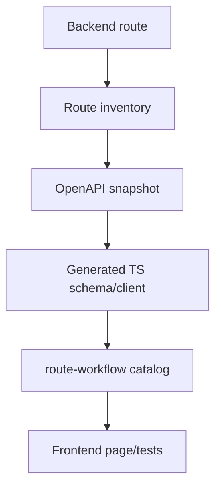

# 07 — Diagrams plan

Include Mermaid diagrams in the target guides:

## Repo responsibility map

## Governed fake E2E sequence

## Evidence Spine resolution flow

## Domain/model/provider boundary

## Contract discipline ladder

