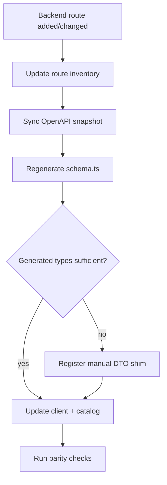

# Contract discipline standard (CONTRACT-DISCIPLINE-001A)

> **Platform contract authority.** Canonical taxonomy for classifying backend routes, frontend
> usage, data-source posture, and OpenAPI/client contract state across the Ontogony operator
> system. Product repos implement inventories, snapshots, and checks; platform owns the vocabulary
> and classification rules.

**Package:** `CONTRACT-DISCIPLINE-001A` — standard + taxonomy  
**Program:** [`CONTRACT-DISCIPLINE-001`](../_incoming/NEXT_2_CONTRACT.md)  
**Repos in scope:** `ontogony-platform`, `ontogony-frontend`, `allagma-dotnet`, `conexus-dotnet`, `kanon-dotnet`

---

## Purpose

The operator system is functionally strong but still relies too often on “it works locally.” This
standard makes every API/UI relationship **explicit, generated, classified, checked, and
documented**.

After CONTRACT-DISCIPLINE-001 completes, a developer can classify any endpoint and know:

- whether the operator UI is allowed to call it
- whether it must appear in generated OpenAPI and TypeScript schema
- whether it belongs in the route-workflow catalog
- whether a handwritten DTO shim is permitted (and must be registered)
- whether the route counts toward live readiness

**Reference implementation:** Kanon (`kanon-dotnet` + `ontogony-frontend` Kanon parity scripts).
Allagma and Conexus should reach the same discipline level in later slices (001C–001D).

---

## Classification dimensions

Every backend route and every frontend page must be classifiable along **four independent
dimensions**. Do not collapse them into a single tag.

| Dimension | Question it answers | Primary artifacts |
| --- | --- | --- |
| **Route exposure** | Who may call this route and under what auth? | Backend route inventory |
| **Frontend usage** | Does operator UI call this route, and where? | Route-workflow catalog, client usage inventory |
| **Data source posture** | Is the page showing live, fixture, or generated data? | Route-workflow catalog `dataSource`, readiness scorecard |
| **Contract state** | Are types generated from OpenAPI or handwritten? | OpenAPI snapshot, generated schema, manual DTO register |

A fifth **route disposition** summary (below) is derived from the four dimensions for parity
checks and coverage reports.

---

## 1. Route exposure (`routeClass`)

Classifies a **backend HTTP route** by intended caller and visibility. Set on every row in a
service route inventory.

| Value | Meaning | UI may call? | Must be in OpenAPI? |
| --- | --- | --- | --- |
| `public_operator` | Operator-facing API under normal service token or project key auth | Yes, when covered by a workflow page | Yes |
| `admin_operator` | Operator admin/diagnostics surface (e.g. Conexus `/admin/v0/*`) | Yes, when covered by a workflow page | Yes |
| `cross_service` | Called by another Ontogony service (Allagma → Kanon, Kanon → Conexus, etc.) | No direct UI unless explicitly bridged in catalog | Yes |
| `internal_backend` | In-process or service-internal; not for operator UI | No | Optional; mark `intentionally_backend_only` if omitted |
| `dev_only` | Local/dev harness, smoke, or debug endpoints | No in production UI | Optional |
| `deprecated` | Scheduled, retained for migration window | Only if catalog marks legacy support | Yes, with deprecation metadata |
| `planned` | Documented but not yet implemented | No | No until implemented |

### Mapping from Kanon `AuthClass`

Kanon inventories today use `AuthClass` (e.g. `SemanticRead`, `SemanticMutate`, `ConexusAssistance`).
When normalizing to `routeClass`:

| Kanon `AuthClass` pattern | Typical `routeClass` |
| --- | --- |
| Operator read/mutate on `/ontology/v0` | `public_operator` |
| Conexus assistance bridge | `cross_service` or `public_operator` (if operator UI calls it directly) |
| Health, internal diagnostics | `internal_backend` or `dev_only` |

Allagma and Conexus inventories should emit `routeClass` explicitly (see target inventory shape
in slice 001C/001D).

---

## 2. Frontend usage (`frontendUsage`)

Classifies **how the operator frontend relates** to a route or client function.

| Value | Meaning |
| --- | --- |
| `ui_page` | Declared on a top-level route-workflow catalog entry (`path` + `page`) |
| `nested_component` | Used only inside a page component, not the catalog entry itself |
| `evidence_resolver` | Called from evidence spine / cross-service resolution (e.g. `resolveEvidenceSpine`) |
| `agent_interaction` | Used by Agent Interaction or AG-UI streaming flows |
| `smoke_only` | E2E, Docker-live smoke, or release-readiness checks only |
| `unused` | Client function or backend route exists but no current UI/workflow consumer |

Every catalog entry must declare:

```text
backendRoutes[]
client functions used (clients[])
generated schema types used
manual DTO adapters, if any
fixture/demo fallback rules
live/fixture/imported data source status
evidence sensitivity / redaction posture
```

Source of truth: `ontogony-frontend/src/app/route-workflow-catalog.json` (merged into
`docs/generated/ROUTE_WORKFLOW_INVENTORY.md`).

---

## 3. Data source posture (`dataSource`)

Classifies **what the operator sees** on a frontend route. Aligns with operator UX taxonomy;
display rules live in the frontend operator-UX contract family.

| Value | Meaning | Counts as live readiness? |
| --- | --- | --- |
| `live` | Direct live backend/API response | Yes |
| `live_with_fallback` | Live response; fixture/generated fills gaps | Only for live-covered fields |
| `fixture_only` | Static fixture or demo data only | No |
| `generated_only` | Build artifact, snapshot, or scorecard only (no live client) | No |
| `imported` | User-imported bundle / JSONL / export replay | No |
| `unknown` | Source could not be determined | No |

**Related:** Operator UX `DATA_SOURCE_TAXONOMY_CONTRACT` uses `fixture` and `generated` where this
standard uses `fixture_only` and `generated_only`. Parity scripts should treat them as equivalent
pairs.

Non-live postures (`fixture_only`, `generated_only`, `imported`, `unknown`) require visible
non-live markers in the UI and must not appear in release-readiness summaries as live validation.

---

## 4. Contract state (`contractState`)

Classifies **typing and snapshot authority** for a route or client call.

| Value | Meaning | Allowed in merge? |
| --- | --- | --- |
| `generated_schema` | Request/response types come from committed OpenAPI → generated `schema.ts` | Yes — preferred |
| `handwritten_adapter` | Intentional manual DTO with registered entry in `MANUAL_DTO_SHIMS.md` | Yes — tracked |
| `transitional_shim` | Temporary manual type; OpenAPI sync pending (001B register) | Yes — time-boxed |
| `stale_snapshot` | OpenAPI snapshot lags backend; UI types may be wrong | No — fix in OpenAPI sync slice |
| `intentionally_backend_only` | Route deliberately excluded from frontend OpenAPI | Yes — must match `routeClass` |

**Markers that require registration** (001B `manual-dto-shims:check`):

```text
Not yet in committed OpenAPI snapshot
manual shim
OpenAPI components omit
unknown normalization
```

---

## 5. Route disposition (derived summary)

Parity and coverage tools collapse the four dimensions into a single **disposition** per backend
route. Every route must fall into exactly one bucket:

| Disposition | Typical signals |
| --- | --- |
| `operator_ui_used` | `routeClass` ∈ {`public_operator`, `admin_operator`} AND catalog or client inventory references the route |
| `generated_client_used` | Disposition above AND `contractState` = `generated_schema` |
| `backend_only` | `routeClass` ∈ {`internal_backend`, `cross_service`} AND no UI/client reference |
| `internal_test_only` | Referenced only by tests, smoke specs, or inventory drift tests |
| `dev_only` | `routeClass` = `dev_only` |
| `deprecated` | `routeClass` = `deprecated` |
| `planned_not_implemented` | `routeClass` = `planned` OR listed in roadmap without backend handler |

---

## Route inventory row (target shape)

Backend repos emit a stable JSON inventory (Kanon already emits
`docs/generated/ONTOLOGY_V0_ROUTE_INVENTORY.json`). Normalized target row:

```json
{
  "method": "GET",
  "path": "/allagma/v0/runs/{runId}",
  "operationId": "getRun",
  "service": "allagma",
  "apiFamily": "runs",
  "auth": "service_token",
  "routeClass": "public_operator",
  "stability": "alpha",
  "requestSchema": null,
  "responseSchema": "RunDetail",
  "errorSchemas": ["CrossServiceErrorEnvelope"],
  "sourceFile": "src/Allagma.Api/Program.cs"
}
```

**Current Kanon shape** uses `Signature`, `AuthClass`, and `Owner`. Kanon remains valid; later
slices may extend fields without breaking existing drift tests.

| Service | Inventory path |
| --- | --- |
| Kanon | `kanon-dotnet/docs/generated/ONTOLOGY_V0_ROUTE_INVENTORY.json` |
| Allagma | `allagma-dotnet/docs/generated/ALLAGMA_V0_ROUTE_INVENTORY.json` (001C) |
| Conexus | `conexus-dotnet/docs/generated/CONEXUS_ROUTE_INVENTORY.json` (001D) |

---

## OpenAPI and generated client authority

Committed OpenAPI snapshots in `ontogony-frontend/openapi/` are the frontend typing authority:

```text
ontogony-frontend/openapi/allagma.v0.json
ontogony-frontend/openapi/conexus.v0.json
ontogony-frontend/openapi/kanon.v0.json
```

Generated TypeScript:

```text
ontogony-frontend/src/allagma/api/generated/schema.ts
ontogony-frontend/src/conexus/api/generated/schema.ts
ontogony-frontend/src/kanon/api/generated/schema.ts
```

**Rule:** No backend route may be used by the frontend unless it appears in the relevant OpenAPI
snapshot **or** is explicitly registered as a temporary handwritten shim.

Sync commands (frontend):

```text
npm run openapi:sync:allagma
npm run openapi:sync:conexus
npm run openapi:sync:kanon
npm run openapi:check
```

---

## Parity check surface (later slices)

Each service should expose frontend scripts comparable to Kanon:

| Service | Route parity | Operator UI coverage |
| --- | --- | --- |
| Kanon | `kanon:route-parity` | `kanon:operator-ui-coverage:sync` / `:check` |
| Allagma | `allagma:route-parity` (001C) | `allagma:operator-ui-coverage:*` (001C) |
| Conexus | `conexus:route-parity` (001D) | `conexus:operator-ui-coverage:*` (001D) |

Cross-service bundle (001F):

```text
npm run contracts:service-parity
npm run contracts:discipline
```

A route is **flagged** when any of these hold:

```text
backend exposes route but OpenAPI misses it
frontend calls route but OpenAPI misses it
route-workflow catalog references route but client does not
client function exists but no page/workflow uses it
route exists in snapshot but backend removed it
catalog path params drift from inventory (e.g. /runtime-posture vs /runtime/posture)
```

Path normalization: compare inventory signatures after expanding `{param}` aliases consistently
(see `ontogony-frontend/scripts/lib/kanon-route-parity.mjs`).

---

## Classification workflow

Use this order when adding or changing an API surface:

1. **Implement** route in the owning backend repo.
2. **Classify** `routeClass`, `auth`, `apiFamily`, `stability` in route inventory.
3. **Regenerate** OpenAPI snapshot and frontend generated schema.
4. **Add or update** client function in `*Client.ts` using generated types where possible.
5. **Declare** workflow catalog entry: `backendRoutes`, `clients`, `dataSource`, fixtures.
6. **Register** any manual DTO shim (001B).
7. **Run** service parity + `openapi:check` before merge.



---

## Repo responsibilities

| Repo | Owns |
| --- | --- |
| `ontogony-platform` | This standard; cross-system gate wrapper (001F); mechanical protocol registry |
| `kanon-dotnet` | Ontology route inventory, OpenAPI baseline, compatibility manifest |
| `allagma-dotnet` | Allagma route inventory, feature matrix, runtime lock participation |
| `conexus-dotnet` | Conexus route inventory, OpenAPI snapshots, compatibility manifest |
| `ontogony-frontend` | OpenAPI snapshots, generated clients, route-workflow catalog, parity scripts, coverage docs |
| `ontogony-ui` | Neutral rendering; no backend route ownership |

---

## Acceptance (CONTRACT-DISCIPLINE-001A)

This slice is complete when:

- [x] `docs/contracts/CONTRACT_DISCIPLINE_STANDARD.md` exists with all canonical classifications
- [x] A developer can classify any endpoint using the four dimensions and derived disposition
- [x] Classifications map to known artifacts (inventory, OpenAPI, catalog, client usage, manual DTO register)
- [ ] Later slices 001B–001F reference this doc as the vocabulary source

---

## Acceptance (CONTRACT-DISCIPLINE-001C)

This slice is complete when:

- [x] `allagma-dotnet/docs/generated/ALLAGMA_V0_ROUTE_INVENTORY.json` exists (25 routes)
- [x] `openapi/allagma.v0.json` synced from backend snapshot (includes `/runtime/posture`)
- [x] `allagma:route-parity` and `allagma:operator-ui-coverage:sync/check` pass
- [x] Route-workflow catalog uses `GET /allagma/v0/runtime/posture` (not `/runtime-posture`)
- [x] Model purposes policy documented: UI uses `/runtime/posture`; `/model-purposes` is backend-only pending OpenAPI
- [x] Runtime posture and evaluation dataset DTOs use generated schema (2 transitional start-run shims remain registered)
- [x] `docs/generated/ALLAGMA_UI_API_COVERAGE.md` emitted

---

## Acceptance (CONTRACT-DISCIPLINE-001D)

This slice is complete when:

- [x] `conexus-dotnet/docs/generated/CONEXUS_ROUTE_INVENTORY.json` exists (41 routes)
- [x] `openapi/conexus.v0.json` includes operator routes (quota, route-preview, evidence-bundle, usage-cost, project model-call evidence)
- [x] `conexus:route-parity` and `conexus:operator-ui-coverage:sync/check` pass
- [x] Quota/route-preview DTOs alias generated OpenAPI schemas (wire snake_case normalization shims remain internal)
- [x] Manual DTO registry no longer lists Conexus quota/route-preview shims
- [x] Route families and explicit parity list in `docs/generated/CONEXUS_UI_API_COVERAGE.md`
- [x] `docs/generated/CONEXUS_UI_API_COVERAGE.md` emitted

---

## Program slices (forward reference)

| Slice | Scope |
| --- | --- |
| **001A** | Standard + taxonomy (this document) |
| **001B** | Client route usage extractor + manual DTO shim register (`ontogony-frontend`: `API_CLIENT_ROUTE_USAGE.json`, `MANUAL_DTO_SHIMS.md`, `client-routes:*`, `manual-dto-shims:*`) |
| **001C** | Allagma route parity (`ALLAGMA-UI-API-PARITY-001`: `ALLAGMA_V0_ROUTE_INVENTORY.json`, `allagma:route-parity`, `ALLAGMA_UI_API_COVERAGE.md`) |
| **001D** | Conexus route parity (`CONEXUS-UI-API-PARITY-001`) |
| **001E** | Kanon hardening (`KANON-UI-API-PARITY-001A`) |
| **001F** | Cross-system gate + companion docs (`API_CONTRACT_SOURCE_OF_TRUTH.md`, coverage matrix, shim policy) |

---

## Related documents

| Document | Relationship |
| --- | --- |
| [`SYSTEM_COMPATIBILITY_GATE.md`](./SYSTEM_COMPATIBILITY_GATE.md) | Six-repo mechanical drift gate (complementary) |
| [`MECHANICAL_PROTOCOL_REGISTRY.md`](./MECHANICAL_PROTOCOL_REGISTRY.md) | Trace, headers, errors — not API route taxonomy |
| [`ONTOGONY_SIX_REPO_COMPATIBILITY_LOCK.md`](./ONTOGONY_SIX_REPO_COMPATIBILITY_LOCK.md) | Version lock across repos |
| `ontogony-frontend/docs/generated/ROUTE_WORKFLOW_INVENTORY.md` | Generated UI ↔ backend map |
| Kanon [`ONTOLOGY_V0_ROUTE_AUTH_MATRIX.md`](https://github.com/uridolan77/kanon-dotnet/blob/main/docs/architecture/ONTOLOGY_V0_ROUTE_AUTH_MATRIX.md) | Reference inventory discipline |

---

## Change control

Additive taxonomy values require a PR to this document and a note in `docs/migrations/`. Renaming
or removing a classification value requires a migration note naming affected repos and parity
scripts.

Breaking changes to **check behavior** follow the CONTRACT-DISCIPLINE gate stage policy (local
advisory → manual CI → runtime-lock pre-release → required PR gate). Do not jump to required PR
gate until 001F lands and slices 001B–001E are green.
