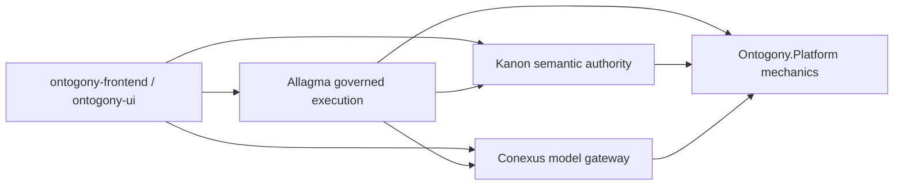

# Architecture map

> **Audience:** cross-repo integrator  
> **Applies to:** all six Ontogony repos  
> **Source of truth:** repo `AGENTS.md`, [`../ARCHITECTURE.md`](../ARCHITECTURE.md), product repo `docs/ARCHITECTURE.md` where present  
> **Last verified:** 2026-05-25

## System diagram



## Ownership table

| Concern | Owner | Examples |
| --- | --- | --- |
| Ontology, domain packs, canonical facts, action policy | **Kanon** | `gaming-core@0.1.0`, decision records, human-gate semantics |
| Runs, tool intents, workflow resume, replay orchestration, eval harness | **Allagma** | `/allagma/v0/runs`, `ToolIntent`, MAF adapter (composition only) |
| Model aliases, provider registry, route resolution, usage/cost | **Conexus** | `/v1/chat/completions`, admin provider config |
| Trace, errors, hashing, idempotency ledger, HTTP resilience | **Ontogony.Platform** | `Ontogony.Http`, `Ontogony.Idempotency`, `Ontogony.Replay.Contracts` |
| Operator console, Evidence Spine resolver, route-workflow catalog | **ontogony-frontend** | `/allagma/runs`, `resolveEvidenceSpine.ts` |
| AppShell, `OperatorPageFrame`, shared UI primitives | **ontogony-ui** | `@ontogony/ui` package |

## Typical request flow (governed run)

```text
Console → Allagma POST /runs
       → Kanon planning / action evaluation
       → Conexus model call (fake or real provider in dev)
       → Allagma events + audit bundle
       → Console Evidence Spine / Run detail
```

Consequential tools: MAF/agent proposes intent → Allagma records `ToolIntent` → **Kanon evaluates** → allow / deny / human_gate → Allagma executes only on allow.

## Local ports (in-memory / script stack)

| Service | Default port |
| --- | --- |
| Kanon | 5081 |
| Conexus | 5082 |
| Allagma | 5083 |
| Aisthesis | 5084 |
| Metabole | 5085 |
| Frontend (Vite dev) | 5173 |
| Frontend (Docker compose) | 5175 |

**Note:** Metabole standalone `dotnet run` defaults to **5084**; in the full five-service Docker stack Metabole is **5085** so Aisthesis can use **5084**.

## Dependency rules (summary)

- Product repos consume `Ontogony.*` **packages**, not each other's implementation projects.
- Allagma: `Kanon.Client` + `Kanon.Contracts` only (not Kanon.Api/Infrastructure).
- Kanon: no Allagma/Conexus implementation assemblies, no LLM SDKs.
- Conexus: no duplicated platform mechanics (tracing, redaction, etc.).

Details: each repo's `AGENTS.md` and `ForbiddenDependencyTests` where present.

## Deep dives by repo

| Repo | Start doc |
| --- | --- |
| Platform | [`../ARCHITECTURE.md`](../ARCHITECTURE.md) |
| Kanon | `kanon-dotnet/docs/CURRENT_STATE.md` |
| Allagma | `allagma-dotnet/docs/CURRENT_STATE.md` |
| Conexus | `conexus-dotnet/docs/CURRENT_STATE.md` |
| Frontend | `ontogony-frontend/docs/CURRENT_STATE.md` |

## Next

- Run locally: [02_RUN_LOCAL_SYSTEM.md](./02_RUN_LOCAL_SYSTEM.md)
- Domain vs routing: [07_DOMAIN_MODEL_ROUTING_BOUNDARIES.md](./07_DOMAIN_MODEL_ROUTING_BOUNDARIES.md)
