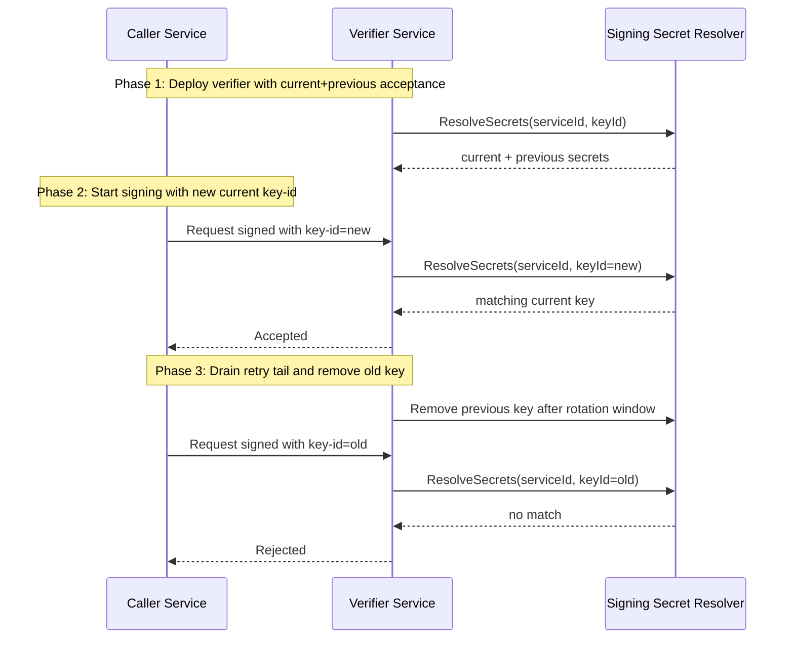

# Service Identity Production Hardening

This guide covers operational mechanics for `Ontogony.Security` service-to-service HMAC verification in production environments.

## Production headers

When `ServiceIdentityOptions.RequireHmacSignature` is enabled, requests should include:

- `X-Ontogony-Service-Id`
- `X-Ontogony-Service-Key-Id` (recommended, and required when `RequireKeyIdForHmacSignature = true`)
- `X-Ontogony-Service-Timestamp`
- `X-Ontogony-Service-Nonce`
- `X-Ontogony-Service-Body-Hash`
- `X-Ontogony-Service-Signature`

If key-id is missing and `RequireKeyIdForHmacSignature = false`, verification is explicit: the verifier uses the resolver-selected/current secret only.

## Secret resolver mechanics

Use `IServiceSigningSecretResolver` to provide rotation-safe secret sets:

- Current key: signs new outbound requests.
- Previous key(s): accepted temporarily during rollout.
- Unknown key-id: rejected.

Built-in fallback behavior remains available for legacy `IServiceSecretResolver` using a compatibility key-id (`legacy-current`).

## Outbound request signing

`OntogonyServiceIdentitySigningHandler` is a `DelegatingHandler` that computes canonical signatures and sets all service identity headers.

Canonical payload for HMAC remains:

```text
{HTTP_METHOD}\n{PATH_AND_QUERY}\n{TIMESTAMP}\n{NONCE}\n{BODY_HASH}
```

The handler computes `BODY_HASH` from exact outbound request bytes, then signs the canonical string using HMAC-SHA256.

## Replay protection in distributed systems

`InMemoryNonceReplayStore` is process-local and only suitable for tests or single-instance runs.

For production clusters:

- Register a distributed `INonceReplayStore` implementation (for example Redis or SQL).
- Use a retention window at least as large as max accepted timestamp skew plus transport retry tail.
- Partition nonce keys by service id.
- Ensure nonce writes are atomic per `(serviceId, nonce)` pair.

## Middleware ordering diagnostics

`ServiceIdentityBodyHashPreloadMiddleware` now supports diagnostics for unsafe pipeline order.

- `EnableBodyHashPreloadOrderDiagnostics` (default `true`)
- `ThrowOnBodyHashPreloadOrderViolation` (default `false`)

When diagnostics are enabled and endpoint selection already ran, middleware order is considered unsafe for preload hashing. The middleware throws or logs based on `ThrowOnBodyHashPreloadOrderViolation`.

Recommended order:

1. `UseOntogonyServiceIdentityBodyHashPreload()`
2. `UseRouting()`
3. endpoint/auth components that may resolve actor context

## Rotation sequence



## Related docs

- [hmac-signing-vectors.md](./hmac-signing-vectors.md)
- [service-identity-production-checklist.md](./service-identity-production-checklist.md)
- [service-identity.md](./service-identity.md)
